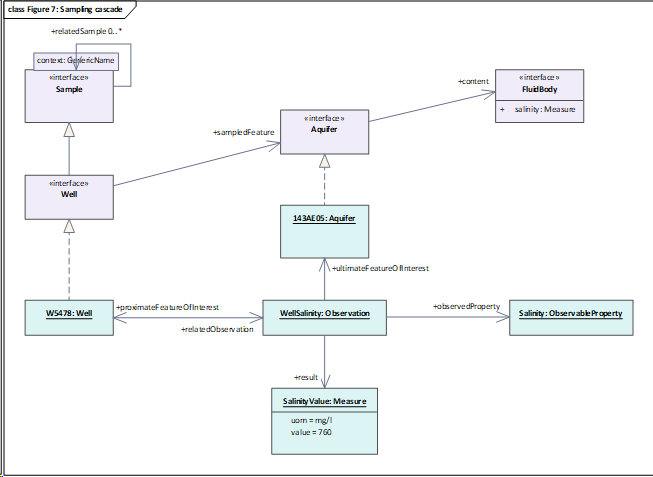

Programme : https://sist.cnrs.fr/webinaire-sensorthings/[[.underline]#https://sist.cnrs.fr/webinaire-sensorthings/#]

== 2/ Historique : du standard SOS au standard SensorThings

- OGC Sensor Web Enablement : https://www.ogc.org/node/698[[.underline]#https://www.ogc.org/node/698#]

- incubation dans la communauté Geoscience (GeoSciML)

- Premier WebService pour les Observation => OGC SOS (fait également partie de la dynamique OGC SWE)

- Finalisation Observations & Measurements (O&M) en 2007 => Des Observations [.underline]#ET# des Samples !

- O&M : 

estimation de la valeur (result) d'une propriété d'un objet (FeatureOfInterest) à l'aide d'une procédure 

- Intégration progressive O&M et OGC SOS dans les modèles INSPIRE et les règles sur les services en réseau

- démonstration de l'utilité/implémentabilité d'O&M dans de nombreux domaines

* projet JRC préalable à la directive
* rapportage qualité de l'air EU basé sur Observations & Measurements et SOS
* puis travaux dans les groupes thématiques INSPIRE pour les spécificatoin de données (INSPIRE Thematic Working Group)
* ensuite intégration officielle des OGC SOS dans les services en téléchargement INSPIRE (il n'y a pas que des objets spatiaux dans INSPIRE :) !)

- Naissance de SensorThings API V1.0

* démarrage dans le monde IoT, par des personnes impliqués dans l'OGC SWE depuis le début
* basé sur Observations & Measurements -> cohérence garantie
* Reconnaissance de SensorThings API également comme un service conforme à la directive INSPIRE
* => utiliser SensorThings API permet d'exposer facilement des données d'observation [.underline]#ET #également de cocher la case 'conformité à la dynamique INSPIRE'

Q ML : si je comprend bien la directive Inspire etait un peu a l'origine de l’élaboration de ces standards OGC O&M, SOS etc ?? ou pas?

A: SG : pas à l'origine à proprement parler mais on constate une claire accélération de l'implémentation et de l'évolution d'O&M depuis le but des travaux fait autour d'INSPIRE. De nombreux retours issus de cette dynamiques ont été poussé dans la révision d'O&M, de SOS et maintenant de SensorThings API

Q : pourquoi ne pas avoir continué sur SOS ?

A : démarrage dans communauté IoT > besoin de glisser vers de 'modern API'  (logique API "Restful") > logique de simplicité (initialement ce modèle devait tourner sur, par exemple un RaspBeryr Py > logique de simplicité pour économiser les ressources > simplification de modèle - sans casser la conformité d'O&M). 

=> ce qui tourne bien sur une machine légère, marche très bien sur des serveurs

== *3/ Présentation du standard SensorThings et de son API*

initiation OGC SWE : Sonde Mars Orbiter s'est écrasée sur Mars à cause de problème de conversion métrique / système impérial => besoin de "métadonnées" sur les observations, et les capteurs

de l'OGC SWE à SensorThings API => "Old" SWE standards VS SensorThings API

SensorThings API se base sur d'autres standards : OASIS oData et MQTT

Notion d'extension en V1.1 => formats (ex : CSV), ajout d'objets métiers

Evolution V2.0 en cours : meilleur intégration oData

Q JCD : qq mots sur Oasis, oData et MQTT ?

A SG : OASIS, oData couvert dans le tutoriel cet après midi

MQTT est dans la logique Publish/Subscribe -> on peut s'abonner à un flux d'information et être notifié quand de l'information est échangée (ce que qui était clairement une limitation du SOS où il fallait reposer les questions ' 'y-a-t-il de nouvelles observations' à une certaine fréquence)

oData : permet une approche graph de données

Commentaire MB : Le fait que 52North (un des leaders historique des implémentations SOS) ait aussi une implémentation STA est aussi une preuve de l'intérêt de STA vs SOS

c'est opérationnel ST API dans 52N ou en dev ? et à quel niveau c'est implémenté? c'est juste une interface interopérable pour accéder aux données de leur BD?

A SG : 52N membre du projet COS4Cloud > SensorThings API for Citizen Science > contribution 52N à une extension 'Citizen Science'  pour ST API. ST API mentionné lors session 52N pour le réseau SIST.

[.underline]#Le modèle ST API#

- Thing : le capteur, la station où les observations sont acquises

- Location / HistoricalLocation -> pratique pour les capteurs/station qui bougent (drône, avion, bâteau, ...)

- DataStream : une collection d'observations (sur une propriété observée, à l'aide d'une méthode d'observation, même unité de mesure)

- phenomenonTime : ex temps où échantillon est pris

- resultTime : temps où le résultat de l'observtion est produit (donc peut être différent du temps d'échantillonnage)

- validTime : validité du résultat

- FeatureOfInterest : l'objet d'intérêt de l'observation : peut être co-localisé avec le Thing mais pas forcément

Q OL : est-ce qu'on peut voir le FoI comme par exemple un rivière et le thing comme un radeau sur cette rivière qui mesure des choses tout au long ? j'ai un peu du mal à comprendre cette distinction Thing/FoI/Location

KS: Does this help (split into proximate and ultimate FoI, proximateFoI is the well you're measuring, ultimate is the aquifer it represents): https://www.dropbox.com/s/l9j2gkubvl32zbb/SamplingCascade.png?dl=0[[.underline]#https://www.dropbox.com/s/l9j2gkubvl32zbb/SamplingCascade.png?dl=0#] (cannot paste images here) => example from the revision of Observations & Measurements

____

____

Q: M : How is the implementation of phenomentime to be able to be a single timestamp or a timePeriod (interval) ?

A: HvdS: In the case of FROST-Server we always store two time instants: start and end. If start and end are the same, the phenomenonTime is a time Instant, if they are different it's a time Interval.

Q JCD: je trouve qu'il y a une confusion entre Thing, Location et FOI sur les exemples proposés sur les 2 premiers. ou River section = Thing Point in river section = FOI

idem sur l'archéologie Thing = Consoli Palace et FOI = Point 

j'avoue que je suis perdu. le concept FOI n'a plus la même signification que dans o&M ? 

A SG : dans Observations & Measurements 

Q M Why don't you use multiDatastreams for lora sensor ?

A HvdS: Since the Observed Properties that are measured are not directly related and are always used separately. Using MultiDatastreams means you always retrieve all values of the Observation at the same time.

Q OL: Il y a-t-il un endroit où on peut trouver tous ces exemples de modélisation ? pour pouvoir se baser dessus

A G : toutes les présentations seront en lignes

Je parlais plus d'un site web qui explique en détail chaque use case qui permet d'aider à la modélisation de son propre système en se basant sur un des use cases. Une sorte de guide. Ça pourrait être intéressant d'avoir ça. Les exemples de Hylke sont très variés, c'est très intéressant, mais ça reste complexe. 

@ HvdS: could you share the link to FROST. With mapping examples 

FROST-Server Documentation: https://fraunhoferiosb.github.io/FROST-Server/[[.underline]#https://fraunhoferiosb.github.io/FROST-Server/#]

FROST-Server GitHub: https://github.com/FraunhoferIOSB/FROST-Server[[.underline]#https://github.com/FraunhoferIOSB/FROST-Server#]

Mapping examples are not there yet, but that's a good idea.

Q/ ML réflexion: bref je vois pas encore comment et ou utiliser ST API... soit c'est une surcouche d'interop au dessus d'un autre modèle de données (BD) qu'on a en local, et là il  faut faire la modélisation pour passer d'un modèle a l'autre

soit c'est "all in one" et tu passes tes données directement dansun applicatif (frost) qui va faire le boulot?

A SG : ça ce n'est pas une situation spécifique à ST API :) c'est pareil à chaque fois que l'on expose des bases historiques (ou faites dans leur coin) quand on veut les exposer de façon interopérable/FAIR. (oui) ... du coup est ce que frost fait pas le boulot intégralement pour des nouvelles données ?

Si on ne part pas d'une BD avec une structure existante (ma compréhension de nouvelles données), il peut être intéressant de mettre ces données dans un schéma proche de celui proposé par STA pour en faciliter l'ingestion (voire utiliser le même !)

== 4.1/ Retours d’expériences sur SensorThings

=== IFREMER – basé sur Geomatys : Dorian Ginane, Mickael Treguer

La logique de décimation présentée a été soumise au groupe OGC  -> https://github.com/opengeospatial/sensorthings/issues/115[[.underline]#https://github.com/opengeospatial/sensorthings/issues/115#]. 

ML: c'est un pb général ca le volume de données qui arrive au client web

A SG : oui, cela fait écho à la notion de généralisation en données géographiques et qui est géré classiquement avec les serveurs 'carto'

L'exemple ici amène un autre 'pattern' d'utilisation de SensorThings API pour faire ce que j’appellerais des "Z-series"

L'usage des 'extensions' est permis par le Standard (c'est aussi ce que nous avons fait côté FROST pour un output format en CSV). Cela permet d'enrichir et d'incuber les choses pour de prochaines évolutions de standard

Depuis la V 1.1 chaque classe peut avoir des informations supplémentaires dans une propriété properties (JSON_Object). Extension beaucoup plus flexible que dans l'approche précédente avec les services web XML qui nécessitaient des XSD.

SG : Sur des recherches à facette nous avons déjà vu des UseCase où un SensorThings API était consommé pour alimenter des solutions ElasticSearch/Kibana

=== *INRAE – Ardon : Donesol – basé sur FROST*: Clement Lattelais, Christine Le Bas, Rachid Yahiaoui, Antoine Schellenberger

L'intérêt d'avoir plusieurs DataStream (quitte, effectivement à un moment d'avoir un point/une observation par DataStream) permet de maximiser la réutilisation des données (des résultats). Par opposition à des approches consistant à avoir des résultats très complexes (mélangeant beaucoup de variables) mais du coup très difficilement re-mobilisables dans d'autres Cas d'Utilisation.

La question de l'authentification autour de l'API est également en discussion côté BRGM avec Fraunhofer (Hylke) et le groupe SensorThings.

M : STAM pour leaflet peut aider ->  https://github.com/DataCoveEU/STAM[[.underline]#https://github.com/DataCoveEU/STAM#]

Q ML: la dernière ligne du slide m'interpelle, est-ce que ST API prévoie la sécurisation des données (ouvert autant que possible, fermé autant que nécessaire)

M : nos travaux ont ajouté une gestion utilisateur sur STAE-No https://github.com/Mario-35/api-sensorthing[[.underline]#https://github.com/Mario-35/api-sensorthing#]

Présentation au TC OGC de Toulouse en 2019 sur l'implémentation de STA pour BDSolU (données sol). L'accent est mis sur comment on a fait le mapping : aller du modèle de données BDSolU vers le modèle de données STA : "French polluted soils information system" dans https://github.com/INSIDE-information-systems/SensorThingsAPI#french-polluted-soils-information-system[[.underline]#https://github.com/INSIDE-information-systems/SensorThingsAPI#french-polluted-soils-information-system#]

Authentification dans groupe standardisation ST API / implémentation

> FROST: partiellement suites aux projets sur la Citizen Science dans FROST => notion d'ownership : on ne peut rajouter des observations que si on a l'ownership sur le DataStream

> technicalement faisable dans le standard : l'intersection de ce qui est possédé par quelqu'un VS ce qui est accessible par tous n'est pas triviale

> 2 aspects

> authentification peut être rajoutée au-dessus du standard.

> modèle de gestion des droits : très dur à généraliser pour tout UseCase

=== INRAE – UMR SAS : Agrhys – Mario Adam, Hervé Squividant 

Possibilité de générer un graph avec 10 Milliards de points provenant d'une requête sur des MultiDataStream depuis l'implémentation faite en NodeJS (STAE-NO)

Intégration Client ST API dans l'outil MViewer (provenant de la dynamique GéoOrchestra)

SG : Nous avons également de collègues côté services géologiques qui ont également travaillé à exposer des données maillées à l'aide de ST API dans ce cas sur des modèles hydrogéologiques

Q (MB) : STAE-NO basé sur STA v1 ? v1.1 ? > 1.1

Q (OL) : je n'ai pas bien compris dans quelle mesure l'implémentation est propre au projet ou peut être utilisée dans d'autres contextes ? Peut-on voir cette solution comme une solution sur étagère au même titre que Frost par exemple ? > OpenSource

Q (SG)  : nom du profil  qui aide à faire ce mapping model 'maison' -> 'St API' ? numéricien / data stewardt / Scientist ? > bonne question, c'est un peu tout ça.

Possibilité d'avoir des présentations pour faire rentrer des flux ST API dans ses modèles ?

Q (DG) : La visualisation des 4 Miliards de points passe elle par l'API SensorThings ?

> par un output Format = graph

https://geosas.fr/lora/v1.0/MultiDatastreams(3)/Observations?$resultFormat=GRAPH[[.underline]#https://geosas.fr/lora/v1.0/MultiDatastreams(3)/Observations?$resultFormat=GRAPH#]

exemple d'un capteur lora (multidatastreams) 

https://geosas.fr/lora/v1.0/query[[.underline]#https://geosas.fr/lora/v1.0/query#]

pour jouer un peu ....

can help to : http://sensorthings.geosas.fr/apidoc/[[.underline]#http://sensorthings.geosas.fr/apidoc/#] compatible FROST too

Si vous voulez essayer cette version béta du viewer carto https://geosas.fr/sensorthings/[[.underline]#https://geosas.fr/sensorthings/#]

== 5/ Tutoriel / démonstration de l’utilisation du serveur FROST et de clients

[.underline]#FROST server#

Q OL : il y a-t-il des fonctions d'agrégation (avg, ...) ? l'équivalent du group by ? seulement pour les multidatastream ?

A SG > une librairie de FROST (SensorThings Processor) fait cela et écrit dans un MultiDataStream

Mais l'entrée peut être DataStream et MultiDataStream

Q OL : MQTT est dans le standard ou spécifique à FROST ?

A SG > MQTT est natif dans le standard

Q ML : y a t-il un outil logiciel pour insérer les données dans FROST ? ou bien devons nous inserer les données via des resquetes http seulement ?     Q Maurice; is there a software tool to insert the data into FROST? Or do we have to insert the data via http only?

A. HVDS : 

- https://github.com/FraunhoferIOSB/SensorThingsImporter[[.underline]#https://github.com/FraunhoferIOSB/SensorThingsImporter#]: not User Friendly but very powefull) can do CSV, JSON et peut faire le mapping également. Peut vérifier les duplicates.

- https://github.com/FraunhoferIOSB/FROST-Manager[[.underline]#https://github.com/FraunhoferIOSB/FROST-Manager#]

vous pouvez utiliser notre outil pour importer du csv dans un sensorthings (stream) du coup la taille n'a pas de pb

SG > "notre outil" = qui ? et où est-il ?  (https://geosas.fr/lora/v1.0/query[[.underline]#https://geosas.fr/lora/v1.0/query#])

[.underline]#Clients#

- FROST Manager : is also a client > for easy edits. Support les aggregates et peut les calculer à la volée depuis une source 

- WebGenesis

____
- Fraunhofer IOSB Content Manager platform : not opensource

- un exemple d'usage : https://api4inspire.k8s.ilt-dmz.iosb.fraunhofer.de/servlet/is/107/[[.underline]#https://api4inspire.k8s.ilt-dmz.iosb.fraunhofer.de/servlet/is/107/#] 
____

- client Geomaty Ifremer : examind playground

____
- angular + Apache ECharts
____

-Plugin Qgis : disponible ?

Q SD : Est-il possible de connecter le client helgoland (52N) ?  J'ajoute aussi à la question le client 'R' il existait un plug in qui était intéressant pour les chercheurs. Le tout étant d'avoir des clients interopérables  et modulables pour se connecter à des end-point avec des paramétrages tous identiques (alignement sur le standard).

A SG : pas de retour de la part des personnes présentes. Il faudrait contacter l'équipe 52N (GitHub)

Une piste -> https://github.com/52North/helgoland/issues/44[[.underline]#https://github.com/52North/helgoland/issues/44#] (Simon Jirka : "... In addition, we are currently working on an enhancement of Helgoland so that it can directly talk to OGC compliant SensorThings API instances.") mais le post date de 2019
